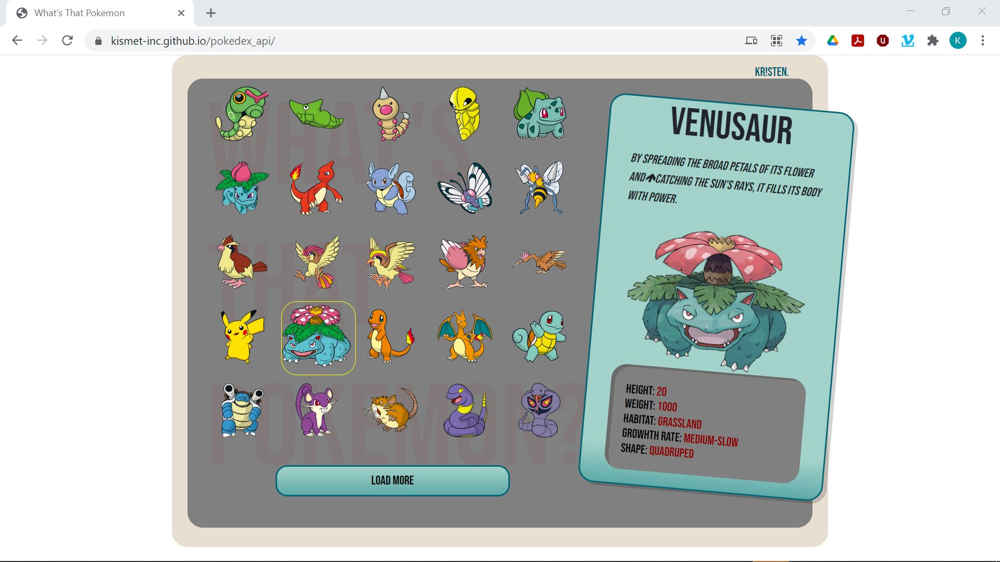

# What's That Pokemon? 
Try it: https://kismet-inc.github.io/pokedex_api/

## Description
**What's That Pokemon** is a simple application that calls the Pokemon API ( https://pokeapi.co/ ) and delivers information about each pokemon as the user hovers over the picture.

##  Screenshots

